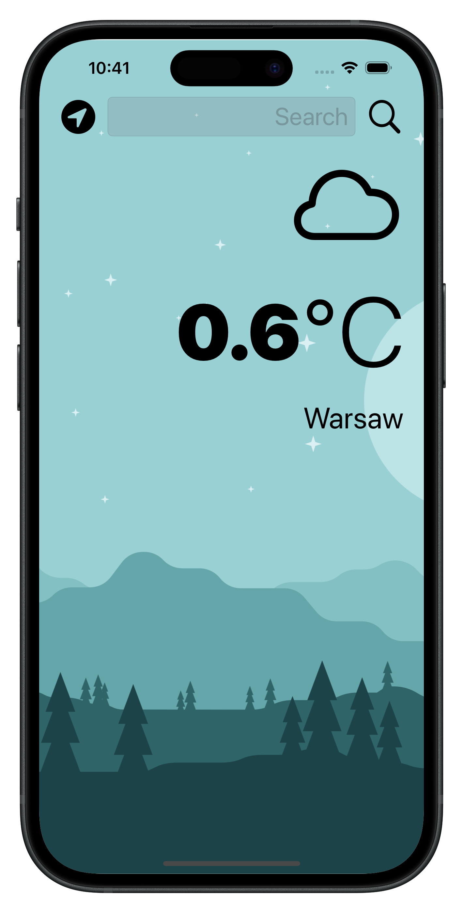

# 🌤 Clima - Weather App  

Clima is a weather application built with **Swift** and **UIKit**, allowing users to fetch real-time weather data for any city or their current location. The app utilizes the **OpenWeatherMap API** to provide accurate weather conditions, including temperature and weather icons.

---

## 🚀 Features  

✅ Search for weather by city name 🌍  
✅ Get real-time weather for your current location 📍  
✅ Display temperature, city name, and weather condition ☀️🌧  
✅ Clean and minimalistic UI with dynamic weather icons 🌈  
✅ API integration with **OpenWeatherMap**  

---

## 🎥 Screenshots  

###  LIGHT MODE  
  

###  DARK MODE  
  

---

## 🛠 Technologies & Tools  

- **Swift 5.0**  
- **UIKit**  
- **CoreLocation** (for fetching GPS location)  
- **URLSession & JSONDecoder** (for API requests and parsing)  
- **MVC Architecture**  

---

## 🎯 What I Learned While Building This App  

📌 **How to fetch and parse JSON data from an API (`URLSession` & `JSONDecoder`)**  
📌 **Handling errors in networking with delegation (`WeatherManagerDelegate`)**  
📌 **Working with `CoreLocation` to fetch real-time GPS location**  
📌 **Using `protocols` and `delegates` for communication between view controllers**  
📌 **Best practices for structuring network requests in Swift**  

---

